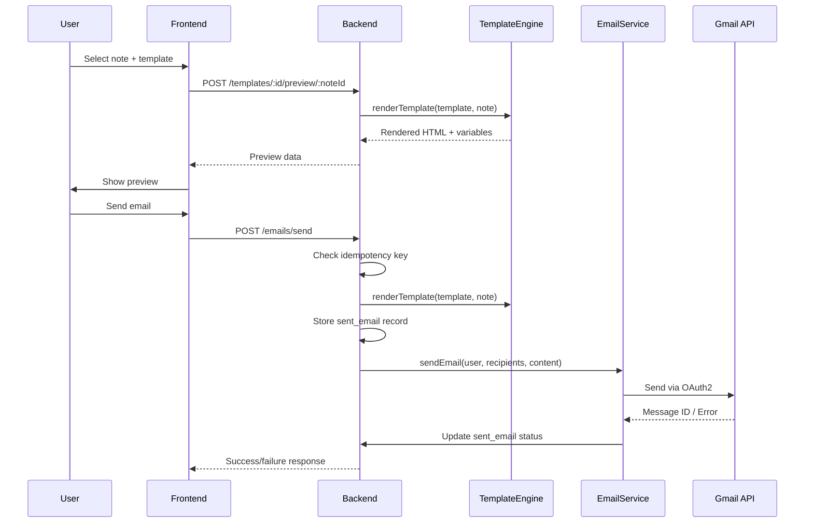
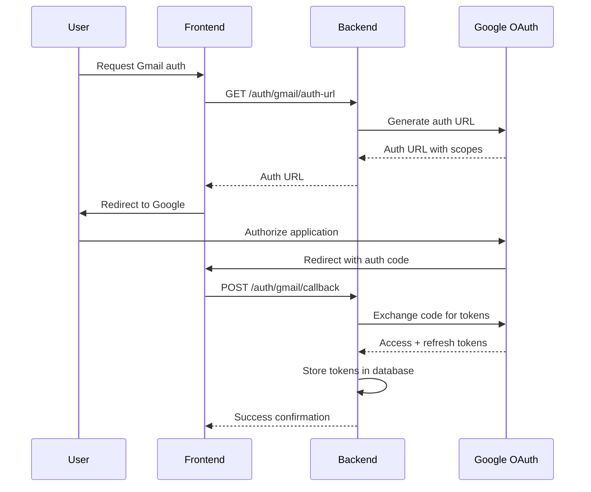
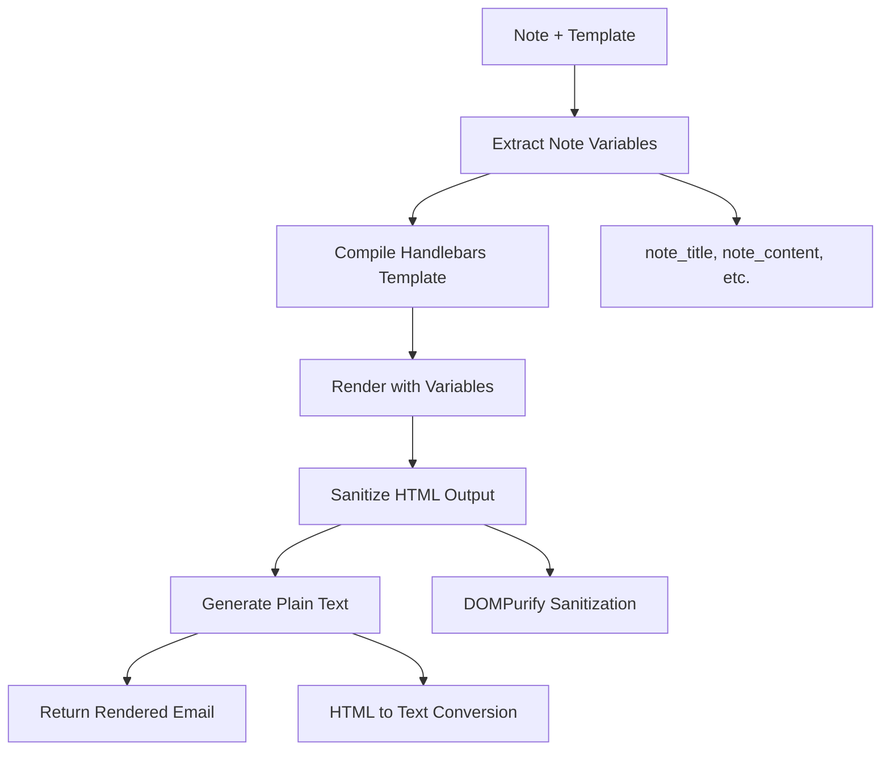

# Architecture Documentation

## System Overview

The Notes to Email application is a full-stack web application that enables users to convert their notes into professional emails using customizable templates. The system implements a "send-as-user" functionality where emails are sent through the user's own Gmail account using OAuth2 authentication.

## High-Level Architecture

```
┌─────────────────┐    ┌─────────────────┐    ┌─────────────────┐
│   React SPA     │    │  Express API    │    │   PostgreSQL    │
│   (Frontend)    │◄──►│   (Backend)     │◄──►│   (Database)    │
└─────────────────┘    └─────────────────┘    └─────────────────┘
                                │
                                ▼
                       ┌─────────────────┐
                       │   Gmail API     │
                       │   (OAuth2)      │
                       └─────────────────┘
```

## Data Model

### Core Entities

#### Users
- Stores user authentication and Gmail OAuth tokens
- Supports refresh token storage for persistent Gmail access
- Tracks token expiration for automatic refresh

#### Notes
- Markdown content storage with metadata
- Belongs to user (soft ownership model)
- Provides source data for email templates

#### Email Templates
- Handlebars-based templates with versioning
- Variable extraction and validation
- Soft delete for historical integrity

#### Sent Emails
- Complete audit trail of sent emails
- Idempotency key tracking
- Template version snapshots
- Status tracking (pending/sent/failed)

### Database Schema Highlights

```sql
-- Template versioning trigger
CREATE TRIGGER create_template_version_trigger 
    BEFORE UPDATE ON email_templates 
    FOR EACH ROW EXECUTE FUNCTION create_template_version();

-- Idempotency constraint
ALTER TABLE sent_emails ADD CONSTRAINT unique_idempotency_key UNIQUE (idempotency_key);
```

## Critical Flows

### 1. Email Composition and Sending



### 2. Gmail OAuth Flow



### 3. Template Engine Processing



## Error Handling

### Template Validation
- Handlebars syntax validation before save
- Variable extraction and type checking
- Graceful handling of missing variables

### Email Sending Failures
- Automatic retry mechanism for failed sends
- Detailed error logging and user feedback
- OAuth token refresh on authentication failures

### Idempotency Implementation
- UUID-based idempotency keys
- Database constraint enforcement
- Graceful handling of duplicate requests

## Security Architecture

### Authentication & Authorization
- JWT-based session management
- User-scoped data access (row-level security)
- OAuth2 for Gmail API access

### Input Sanitization
- DOMPurify for HTML content sanitization
- Parameterized SQL queries
- Template syntax validation

### Rate Limiting
- Token bucket algorithm implementation
- Separate limits for email sending vs. general API
- User-specific rate limiting

### Content Security
```javascript
// Allowed HTML tags for email content
ALLOWED_TAGS: [
  'p', 'br', 'strong', 'em', 'u', 'h1', 'h2', 'h3', 'h4', 'h5', 'h6',
  'ul', 'ol', 'li', 'blockquote', 'a', 'img', 'table', 'thead', 'tbody',
  'tr', 'td', 'th', 'div', 'span', 'pre', 'code'
]
```

## Idempotency Design

### Key Generation
- Client-provided or server-generated UUID
- Stored with sent email record
- Unique constraint at database level

### Duplicate Detection
```sql
-- Check for existing email with same idempotency key
SELECT * FROM sent_emails WHERE idempotency_key = $1
```

### Response Handling
- Return existing result for duplicate requests
- Maintain consistent response format
- Preserve original timestamps

## Performance Considerations

### Database Optimization
- Indexes on frequently queried columns
- Connection pooling for concurrent requests
- Soft deletes to maintain referential integrity

### Template Caching
- Compiled Handlebars templates cached in memory
- Variable extraction cached per template version
- Invalidation on template updates

### Email Delivery
- Asynchronous processing for large recipient lists
- Batch processing for multiple emails
- Retry queue for failed deliveries

## Monitoring and Observability

### Logging Strategy
- Structured logging with correlation IDs
- Email send success/failure tracking
- OAuth token refresh monitoring

### Metrics Collection
- Email send rates and success rates
- Template usage analytics
- User engagement metrics

### Error Tracking
- Detailed error context for debugging
- User-friendly error messages
- Automatic retry mechanisms

## Scalability Considerations

### Horizontal Scaling
- Stateless API design
- Database connection pooling
- Load balancer compatibility

### Data Growth
- Pagination for large datasets
- Archive strategy for old sent emails
- Template version cleanup policies

### Rate Limiting
- Distributed rate limiting for multi-instance deployments
- User-specific quotas
- Graceful degradation under load

## Future Enhancements

### Multi-Provider Support
- Outlook/Office 365 integration
- Custom SMTP server support
- Provider abstraction layer

### Advanced Features
- Email scheduling
- Template marketplace
- Collaborative editing
- Advanced analytics

### Performance Optimizations
- Redis caching layer
- Background job processing
- CDN for static assets
